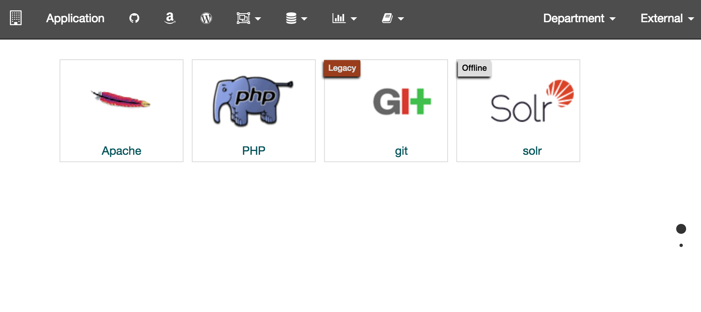

# Jekyll Home Menu
### Department website to organize applications and services

This project will help display and organize your content. The website you create useing jekyll-homemenu, can be run on your server or github. [Jekyll](https://jekyllrb.com/) will generate a static website and github will do this automaticlly. Github does the automatic build with a [gh-pages](https://github.com/tlezotte/jekyll-homemenu/tree/gh-pages) branch.

#### Features
* Bootstrap
  * Responsive
  * Mobile
* FontAwesome
* fullPage
* eModal

 

# [DEMO](https://tlezotte.github.io/jekyll-homemenu)

 
 

#### Desktop

#### Mobile

